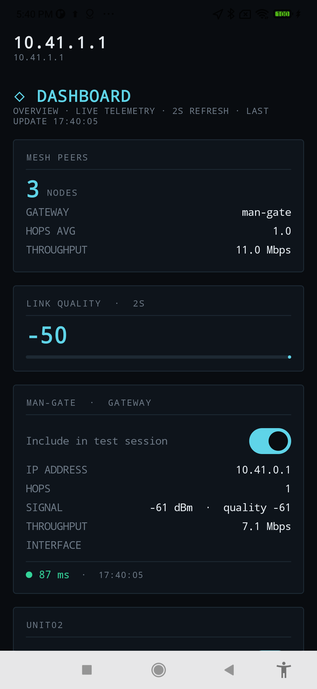

# OpenManet Field Performance Tester

An Android app that runs on an End User Device (EUD) to test performance across an
[OpenManet](https://openmanet.github.io/docs/) mesh network: connect to a node, discover the
mesh, ping targets, track GPS position (device GPS, other units' Cursor-on-Target multicast, and
the node's own NMEA GNSS feed), run iperf2/iperf3 throughput tests, store everything locally as
time series, and export/upload the results as CSV.

GPS position is always shown on the dashboard once connected - it isn't gated on a logging
session being active. Ping/neighbor-stat logging and iperf tests are each independently
start/stop-able and keep running in the background (as foreground services) if you navigate away
or background the app.

The app does **not** manage Wi-Fi. You join the mesh SSID yourself via Android's system Wi-Fi
settings before opening the app; the app only talks to the node once you're already on its
network.

## Screenshot



The dashboard's mesh-peers section: an aggregate summary card, then one card per discovered node
with its live API stats (hops, signal, throughput, interface) and its most recent ping result. A
switch on each card includes/excludes that node from the current test session.

## Requirements

- Android Studio (or the command-line tools below) with:
  - Android SDK platform 37+, build-tools 35/37
  - NDK 29 (side-by-side), only needed if rebuilding the vendored iperf2/iperf3 binaries
- [`buf`](https://buf.build/docs/installation/) and `protoc`, only needed if regenerating the
  Connect-RPC client from the vendored `.proto` files
- A physical Android device (minSdk 29) or emulator to actually exercise mesh connectivity,
  GPS, ping, and iperf2/iperf3 - none of that is meaningfully testable in a JVM unit test

## Building

```sh
./gradlew assembleDebug
adb install -r app/build/outputs/apk/debug/app-debug.apk
```

Unit tests (parsers, Room DAOs, the connection state machine) run without a device:

```sh
./gradlew testDebugUnitTest
```

### Building without installing anything locally

`docker/Dockerfile` packages the Android SDK, `buf`, and `protoc` so none of that needs to be
installed on the host - only Docker itself:

```sh
./scripts/docker_build.sh                     # assembleDebug (default)
./scripts/docker_build.sh testDebugUnitTest
./scripts/docker_build.sh assembleDebug testDebugUnitTest
```

Builds (or reuses a cached) image, then runs the repo's own `./gradlew` inside a container with
the repo mounted at `/workspace` - output APKs and test reports land in the normal
`app/build/...` paths on the host, owned by you (the container runs as your own uid:gid, not
root). Gradle/SDK downloads are cached in `.gradle-docker/` inside the repo (gitignored) so they
survive across runs. Once it finishes, the APK is at the same path as a native build and installs
the same way:

```sh
adb install -r app/build/outputs/apk/debug/app-debug.apk
```

Forces the image to `linux/amd64` even on Apple Silicon: AGP's `aapt2` native binary isn't
reliably published for `linux/arm64`, and letting the base image resolve to arm64 while `aapt2`
resolves to amd64 produces a broken mixed-arch container - confirmed hitting exactly that
failure before pinning the platform. Docker Desktop emulates amd64 transparently either way, at
some speed cost on Apple Silicon.

The image deliberately does **not** include the NDK - only `scripts/build_iperf2.sh`/
`build_iperf3.sh` (rebuilding the vendored native binaries, not part of a normal app build) need
it, and it's a multi-gigabyte download not worth carrying by default.

## Sideloading onto a device

```sh
./scripts/build_sideload_apk.sh
```

Runs the unit tests, builds a debug APK, and copies it to `dist/manet-perf-app-<version>-debug-<timestamp>.apk`. If exactly one device is attached over adb, it installs it directly; otherwise it prints the path so you can copy it to the phone and install it by hand (tap the file in a file manager, or transfer it via USB/AirDrop/a link - Android will prompt to allow installing from that source the first time).

Flags: `--skip-tests` to skip the test run, `--no-install` to always just build and copy without touching adb.

This deliberately builds the **debug** variant, not a release build: it's signed automatically with the machine-local debug keystore (the same signing this project's on-device testing has used throughout - see `CLAUDE.md`), so there's no keystore to create or manage. That also means an APK built this way on one machine won't cleanly *update* one built on another (different debug keystores don't match) - uninstall the old copy first if you hit `INSTALL_FAILED_UPDATE_INCOMPATIBLE`. A real release build (its own signing keystore, minification, a stable identity for OTA-style updates) is a separate, bigger decision this script intentionally doesn't make for you.

## Reviewing results on a desktop

`viewer/` is a small Python (Flask + SQLite + Leaflet) web tool that ingests the CSV files the
app exports and plots each session on an interactive map, with a session dropdown, color-by
metric (signal, throughput, ping, quality) and a two-point distance measuring tool. See
[`viewer/README.md`](viewer/README.md).

```sh
cd viewer && python3 -m venv .venv && .venv/bin/pip install -r requirements.txt
.venv/bin/python app.py          # http://127.0.0.1:5050
.venv/bin/python app.py --lan    # also accept the app's Export-screen upload from a phone
```

With `--lan` it prints the URL to paste into the app's Export screen "Endpoint URL" field, and
uploads land directly in the viewer's database (this replaced `scripts/upload_test_server.py`).

## Project layout

Single-module Compose app, packages organized by feature:

```
app/src/main/java/net/openmanet/perfapp/
  connectivity/   node-address entry, default-gateway detection (no Wi-Fi management)
  auth/           encrypted per-node credential storage (EncryptedSharedPreferences)
  rpc/            Connect-RPC client to openmanetd (cached/reused per node+network), one
                  repository per service, real auth, node-identity dedup/hostname cleanup
  ping/           ICMP ping via /system/bin/ping subprocess (no root required)
  cot/            SA multicast listener (239.2.3.1, ports 6969 CoT XML + 4349 openmanetd's raw
                  NMEA GNSS feed), CoT XML parser, NMEA 0183 parser
  gps/            device GPS (FusedLocationProviderClient), source merging by GpsSource
                  (DEVICE/COT/NODE_GNSS), and LiveGpsHolder for always-on dashboard display
                  independent of whether a logging session is active
  iperf/          iperf2 + iperf3 subprocess bridge (vendored native binaries, selectable per
                  run) + output parser (iperf3 text, iperf2 `-y C` CSV)
  session/        foreground services: TestSessionService (ping + neighbor-stat logging) and
                  IperfSessionService (standalone, independently start/stoppable iperf runs),
                  sharing a common ForegroundSessionService base
  data/           Room entities/DAOs/database, CSV export, upload
  settings/       app settings persisted via DataStore (refresh interval, disabled nodes,
                  preferred GPS source)
  ui/             one package per screen, plus nav/ for the NavHost and shared ViewModels
```

`app/src/main/proto/` holds the vendored `openmanetd` `.proto` files (pulled from
`buf.build/openmanet/protobufs`). `app/src/main/kotlin-gen/` (gitignored) holds the generated
Connect-RPC Kotlin/Java stubs; regenerate with:

```sh
./scripts/generate_proto.sh
```

`app/src/main/jniLibs/<abi>/libiperf3exec.so` and `libiperf2exec.so` are real `iperf3`/`iperf2`
binaries cross-compiled for Android (see `scripts/build_iperf3.sh`/`scripts/build_iperf2.sh` -
only need to be re-run when bumping a version or adding an ABI, not on every build). OpenManet
nodes run iperf2 by default - iperf2 and iperf3 are wire-incompatible, so pick the engine
matching whatever's actually listening on the target.

`viewer/` is the standalone desktop session viewer (`app.py` Flask backend, `static/index.html`
single-page Leaflet map); it is independent of the Android build.

See `CLAUDE.md` for the non-obvious decisions and gotchas behind this setup.
